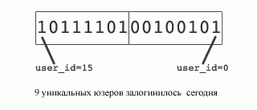

## Realtime-статистика счетчиков с использованием битмапов

Сначала пару слов о Redis. В официальном мануале Redis [[1]](#lnk) каждая операция оценена временем выполнения вида O(f(x)). 
Наиболее быстрые по времени выполнения операции оцениваются как O(1). 
Подробнее об этой оценке можно почитать в Википедии [[2]](#lnk) и здесь [[3]](#lnk).

Оригинал: Fast, easy, realtime metrics using Redis bitmaps [[4]](#lnk) © Chandra Patni, 29/10/2011.

Некоторые понятия в переводе на русский звучат совсем коряво, приношу свои извинения.

В Spool (был такой сервис закладок*) мы считаем наши ключевые метрики в реальном времени.
Традиционно, показатели собираются в пакетном режиме (ежечасно, ежедневно, и т.д) Redis поддерживая битмэпы позволяет
нам выполнять такие вычисления в реальном времени с экстремально эффективным использованием пространства (речь про
память и место на hdd). В симуляции 128 миллионов пользователей, вычисление типичного показателя, такого
как "уникальные посетители за день", заняло меньше 50мс на MacBook Pro и всего 16Мб памяти.

Spool еще не имеет 128 миллионов пользователей, но приятно знать, что наш подход масштабируется. Мы подумали, нам
следует рассказать, как мы это сделали, может в других стартапах наш метод будет полезен.
Ускоренный курс по битмэпам вообще и Redis битмэпам в частности

### Bitmap (Bitset)

Битмэп или битсет это массив нулей и единиц. Бит в битсете может быть установлен в 0 или 1, и каждая позиция в массиве
называется смещением (offset). Такие битовые операции, как логическое AND, OR, XOR и другие, вполне применимы к
битмэпам.

Для дальнейшего ликбеза загляние в Википедию [[5]](#lnk).

### Population count

"Population count" дословно переводится "количество населения", применительно к информации подразумевает количество
единиц в двоичной записи каких-либо данных. Рискну назвать это по-русски, как "счетчик единиц".

Количество единиц битмэпа это число бит, установленных в 1. Есть эффективные алгоритмы для расчета этого количества. К
примеру, подсчет единиц битмэпа, заполненного на 90% и содержащего миллиард бит, займет 21.1мс на все том же MacBook
Pro. Есть даже ассемблерные инструкции группы SSE4 для получения счетчика единиц, как целого числа.
Population count


<span class="caption">Битмэпы в Redis</span>

Redis принимает бинарные ключи и бинарные значения. Битмэпы - ничто иное, как бинарные значения. Операция setbit(key,
offset, value), которая занимает O(1) времени выполнения, устанавливает значение бита в 0 или 1 по определенному
смещению для переданного ключа.
Простой пример: активность пользователей за день

Для подсчета уникальных юзеров, которые вошли сегодня, мы создаем битмэп, где каждый пользователь определяется
смещением на карте. Когда пользователь посещает страницу или выполняет действие, которое нужно считать, ставим в единицу
бит по адресу (смещению), соответствующую id пользователя. Ключ, определяющий соответствующий битмэп, это функция с
именем действия юзера и меткой времени (timestamp).



<span class="caption">Количество уников за день</span>

В этом простом примере, с каждым входом пользователя мы выполняем:

```
redis.setbit(daily_active_users, user_id, 1)
```

Эта операция установит в 1 бит по соответствующему смещению в битмэпе `daily_active_users`. По времени выполнения займет O(1).
Выполним подсчет единиц в этом битмэпе, результат - 9 уникальных пользователей пришли сегодня. 
Ключ `daily_active_users` значение `1011110100100101`.

Запрос на получение "population count" можно выполнить в любое время, т.о. получаем статистику реального времени.

Конечно, поскольку дневная активность пользователей меняется каждый день, нам нужно создавать новый битмэп ежедневно. 
И мы делаем это простым добавлением даты в имя ключа битмэпа. 
Например, если мы хотим подсчитать ежедневных уников, которые проиграли хотя бы одну песню в музыкальном приложении 
в конкретный день, мы можем задать имя ключа так `play:yyyy-mm-dd`. 
Если мы хотим подсчитать число уникальных пользователей, проигрывающих песню каждый час, можно назвать ключ `play:yyyy-mm-dd-hh`. 
В дальнейшем изложении мы будем придерживаться дневных уников, проигравших песню. 
Для сбора дневных метрик, мы просто будем поднимать бит (ставить с 1) в ключе `play:yyyy-mm-dd`, когда юзер слушает песню. 
Это операция O(1) времени выполнения.

```
redis.setbit(play:yyyy-mm-dd, user_id, 1)
```

Уникальные пользователи, прослушавшие песню сегодня - это количество единиц (population count) битмэпа, хранящихся в
значении ключа `play:yyyy-mm-dd`. Для подсчета недельных или месячных метрик, мы просто можем объединить дневные битмэпы
(логическое ИЛИ) за неделю или месяц, и затем вычислить счетчик единиц результирующего битмэпа.

### Счетчик за неделю

Вы так же очень просто можете создать более сложные метрики. Например, премиум-пользователи, кто прослушал песню в Ноябре,
получатся так:

```
(play:2011-11-01 OR play:2011-11-02 OR...OR play:2011-11-30) AND premium:2011-11
```

### Сравнение производительности с использованием 128 миллионов пользователей

Таблица ниже демонстрирует сравнение дневных уникальных вычислений, рассчитанных за каждый день, 7 дней и 30 дней для 128
миллионов пользователей. Метрики 7 и 30 рассчитаны объединением дневных битмэпов.

| Период | Время (мс) |
|--------|------------|
| День   | 50.2       |
| Неделя | 392.0      |
| Месяц  | 1624.8     |


### Оптимизация

В примере выше мы смогли оптимизировать расчеты недели и месяца за счет кеширования дневных, недельных, месячных
счетчиков в Redis. Это очень гибкий подход. Дополнительный плюс кеширования в том, что оно позволяет проводить быструю
групповую аналитику, типа уникальные пользователи за неделю, кто так же является пользователями мобильников - пересечение
битмэпа мобильных пользователей с битмэпом недельной активности. Или, если мы хотим посчитать уникальных посетителей,
пришедших повторно за последние N дней, имея кешированные уникальные счетчики, сделать это легко - возьмите предыдущие
N-1 дней из кеша и объедините со счетчиком реального времени. Это займет всего 50мс.


### Адреса ссылок, использованных в статье: 
<span id="lnk"></span>

1. [http://redis.io/commands](http://redis.io/commands)
2. [Википедия: вычислительная сложность](http://ru.wikipedia.org/wiki/Асимптотическая_сложность)
3. [Книга о Redis: Асимптотическая Сложность](https://github.com/kondratovich/the-little-redis-book/blob/master/ru/redis.md#Асимптотическая-Сложность-Запись-Большое-o)
4. [Fast, easy, realtime metrics using Redis bitmaps](http://blog.getspool.com/2011/11/29/fast-easy-realtime-metrics-using-redis-bitmaps/)
5. [Битовая карта](http://ru.wikipedia.org/wiki/Битовая_карта)

